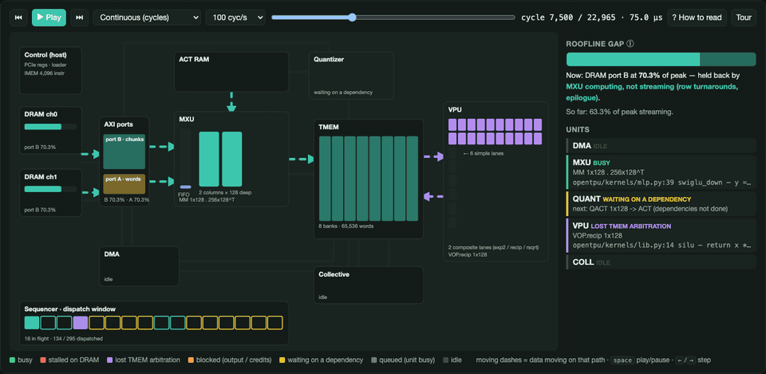

# openTPU

openTPU is a small, open TPU you can read end to end. It's meant for learning and poking at
the whole stack: the hardware, the compiler and kernels on top of it, and the instruction set
in between. Change one of them, run the tests and the profiler, and you can see what that
change did to the cycles.

It isn't a toy, though. It runs Qwen3-0.6B with real weights and matches Hugging Face token
for token. The RTL is bit-exact with the instruction-set simulator. It targets a real board: a
Kintex-7 xc7k480t PCIe card with two DDR3 channels.



*Lens replaying part of a Qwen3 decode step (board configuration), 100 cycles per second. The
dashes are data moving. The colours show what each unit is doing in that cycle: busy, stalled
on DRAM, lost TMEM arbitration, or waiting on a dependency.*

## What's in here

```
 kernels (opentpu/kernels)          mlp, attention, a full Qwen3 layer      <- written in `ol`
        |  @ol.jit, traced once per slice (SPMD)
 language + compiler                opentpu/language.py, opentpu/compiler.py
        |  layouts, affine loop addressing, fusion peepholes, bank-aware strides
 ISA (docs/isa.md)                  opentpu/isa.py         8 x 32-bit words per instruction
        |                                       \
 bit-exact ISA simulator            RTL (SystemVerilog, rtl/) under Verilator
 opentpu/isasim.py      <== same DRAM + TMEM bits ==>   rtl/top/otpu_top.sv
        |                                                       |
 host runtime + CLI (opentpu/host)  ---- PCIe (XDMA) ---->  board: rtl/boards/ypcb-00338
```

Each layer is tested against the one below it. Kernels are checked against float64 numpy
references. The ISA simulator is checked against a bit-exact Python fp32 model. The RTL has to
produce the same DRAM and TMEM bits as the ISA simulator, including on random programs full of
hazards.

The machine is simple on purpose. There is a matrix unit that streams weights, a vector unit,
a quantizer, a DMA engine and a collective unit for multi-slice runs. The on-chip memories are
explicit, and there are hardware loops. Every data movement is one instruction you can see in
the trace, so when something is slow the profile tells you why.

## Why it exists

Most accelerator stacks are either closed or too big to hold in your head. This one is about
10k lines of Python and SystemVerilog. Decode is DRAM-bound, which gives you a hard number to
aim at: the roofline, the time it takes just to read every weight byte once. That makes it a
good place to try things:

- **Hardware.** Pipeline a unit, change the TMEM arbitration, widen the MXU. The tournament
  (below) and yosys tell you about area and fmax. The RTL tests tell you whether you broke
  something.
- **Software.** Write a kernel in `ol`, the small Triton-like language, and see how close it
  gets to the roofline.
- **ISA.** Add an instruction or a fused epilogue, then carry it through the assembler, the
  simulator, the RTL and the compiler.

Right now the MLP runs at 99.5% of the DRAM roofline and flash attention at about 98%. Before
the scoreboard and the fusions they were at 93% and 30%.

## Architecture

```
            host: program images, DRAM images in, DRAM out
                                  |
 +--------------------------------v-------------------------------------+  x S slices
 | SEQ  1 instr/cycle into a 32-slot scoreboard; 16 regs, LOOP, addr regs|
 |   +--> DMA (LD/ST)      DRAM burst port                              |
 |   +--> MXU (MM)         1 streamed D-byte int8 row/cycle from DRAM   |
 |   |      x M <= 8 stationary rows from ACT RAM, block scales, fp32   |
 |   +--> QUANT (QACT/QST) TMEM fp32 -> ACT RAM int8 | DRAM int8 (KV)   |
 |   +--> VPU (VOP)        LANES x fp32: add mul max exp2 recip rsqrt   |
 |   +--> COLL (GATHER/BAR) ---------------- shared by all slices ------+--> other slices
 |  TMEM: LANES banks, arbitrated per cycle                             |
 |  ACT RAM: int8 activations + scales; DRAM: private per slice         |
 +----------------------------------------------------------------------+
```

- **Numerics.** Weights, MXU activations and the KV cache are block-scaled int8, with one fp32
  scale per D elements. Everything else is fp32 with round-to-nearest-even and flush-to-zero.
  exp2, recip and rsqrt are fixed sequences of adds and multiplies, so Python, the simulator and
  the RTL agree bit for bit.
- **Concurrency.** The sequencer issues one instruction per cycle into a 32-entry window and
  tracks what each instruction reads and writes. An instruction starts as soon as nothing older
  conflicts with it, so all the units overlap without the compiler having to schedule them.
- **Attention** is flash attention with an online softmax. It is software-pipelined: q·Kᵀ for
  the next block streams while the softmax of the current one runs. **MLP** streams gate and up
  for the next chunk while the VPU computes SiLU. Every weight byte is read exactly once.

The details are in [the design spec](docs/superpowers/specs/2026-09-23-opentpu-design.md),
[docs/isa.md](docs/isa.md) and [docs/compiler.md](docs/compiler.md).

## Writing a kernel

```python
from opentpu import language as ol

@ol.jit
def mlp(h, gamma, w_gate, w_up, w_down, out, eps):   # simplified; see kernels/mlp.py
    x = ol.load(h)
    xs = ol.quantize(rmsnorm(x, ol.load(gamma), eps))   # ACT RAM, reused by both matmuls
    g = ol.dot(xs, w_gate)                              # this slice's columns
    u = ol.dot(xs, w_up)
    a = ol.all_gather(silu(g) * u)
    y = ol.all_gather(ol.dot(a, w_down))
    if ol.program_id() == 0:
        ol.store(out, x + y)
```

```python
from opentpu import Config
from opentpu.runtime import Input, Output, Weight, launch

res = launch(mlp, Config(S=2), backend="rtl",            # or "isa"
             h=Input(h), gamma=Input(g), w_gate=Weight(Wg, 0), w_up=Weight(Wu, 0),
             w_down=Weight(Wd, 0), out=Output((M, H)), eps=1e-6)
```

## Lens

Lens is the profiler. It records a run (an RTL cycle trace, an ISA-simulator run, or the
hardware trace buffer on the board) and opens it in the browser. It has four views:

- an overview with the roofline and where every DRAM cycle went;
- a zoomable timeline;
- the floorplan above, which replays the run one cycle at a time;
- per-instruction and per-source-line tables, so a stall points back to a line of kernel code.

```
python3 -m opentpu.lens record mlp attn -o run.otpuprof
python3 -m opentpu.lens open run.otpuprof
```

On the board the same view comes from hardware. A trace buffer in the fabric logs dispatch,
start, grant and end events, plus the per-unit counters. The host rebuilds exactly the trace
lines the simulator prints for the same program, and a test checks that they match. See
[docs/lens.md](docs/lens.md) and [docs/observability.md](docs/observability.md).

## The auto-arch tournament

A lot of the RTL wasn't tuned by hand. `tools/tourney` runs an automated hill climb on one
component at a time, in the style of
[auto-arch-tournament](https://github.com/FeSens/auto-arch-tournament). Each component has a
champion branch. Every round works like this:

1. A few agents each read the current champion, its critical path, and a log of what earlier
   rounds tried and learned.
2. Each one writes a hypothesis ("register the TMEM read data in front of the prescale
   multiplier"), and another agent implements it in its own worktree.
3. Every candidate goes through the same gates: sandbox (only its own files changed), lint,
   bit-exact RTL-vs-ISA tests on two micro-architectures, a Qwen3 decode performance proxy, and
   the kernel roofline tests.
4. It is then synthesized with yosys. A candidate is accepted only if it is smaller at the same
   speed, or faster at the same size.
5. The best accepted candidate becomes the new champion, and the log gets one more line of
   lessons.

The first overnight run tried 96 changes across the fp operators, quantizer, sequencer, MXU,
VPU and AXI adapter, and kept 38. Together with some hand-made cross-unit fixes, the full-board
estimate went from 41 MHz to 106 MHz and from 132k to 82k LUTs. The logs and patches are in
`tools/tourney/runs/`, and [docs/tourney.md](docs/tourney.md) explains how to run one.

```
make tourney COMP=otpu_vpu N=5 K=2     # 5 rounds, 2 candidates per round
make tourney-report COMP=otpu_vpu      # REPORT.md and a progress plot
```

## On the board

The target is a YPCB-00338 card with an xc7k480t, two DDR3 SODIMM channels through MIG, and
PCIe through XDMA. The build scripts, constraints and bring-up steps are in
[docs/board.md](docs/board.md). A cycle-accurate board model (`sim/verilator/tb_board.sv`,
with the register block, program loader, AXI and two DDR3 channels with random stalls) runs
the full Qwen3-0.6B bring-up through the same host driver the card uses.

The host side is a set of small command-line tools on top of the stock Xilinx XDMA driver:

```
otpu-selftest            registers, DRAM patterns, kernels, then Qwen3 (--sim for the board model)
otpu-chat                chat with Qwen3-0.6B on the card
otpu-smi                 temperature, estimated power, DRAM use, per-unit utilization, tok/s
otpu-lens                record a hardware trace from the card and open it in Lens
```

Temperature is measured (the XADC, through MIG). Power is an estimate: Vivado's per-unit power
from `report_power`, scaled by the utilization the counters measure. The card has no current
sensor the fabric can read.

## Status

- Qwen3-0.6B: matches Hugging Face on the ISA simulator; bit-exact with it on the RTL at the
  board configuration; about 6.4 M cycles per token, so roughly 15 tok/s at 100 MHz.
- Board model: the full bring-up passes, including Qwen3 decoding.
- FPGA: the Vivado build is next. [docs/status.md](docs/status.md) has the current numbers and
  what to check first on real hardware.

## Running the tests

You need Python 3.11+, numpy and pytest. The RTL tests also need Verilator 5 and skip
themselves without it.

```
python3 -m pytest -q
```

| Suite | What it checks |
|---|---|
| `test_fp.py` | RTL fp units vs the Python fp32 model on 245K vectors |
| `test_isa.py` | Instruction semantics, loops, collectives, hazard detection |
| `test_compiler.py` | Layouts, loop addressing, broadcasts, fusion safety |
| `test_kernels.py` | MLP and attention on the simulator vs float64 references |
| `test_rtl.py` | Identical DRAM and TMEM on the RTL and the simulator, kernels and random programs |
| `test_perf.py` | MLP and attention stay near the DRAM roofline on the RTL |
| `test_board.py` | The board model through the host driver |
| `test_qwen3.py` | Qwen3 layers against the reference |

## Known simplifications

- QST writes one byte per cycle.
- The MXU dot product is behavioural in simulation; on the FPGA it maps to DSP48 cascades.
- MAX and MIN on NaN inputs are undefined.
