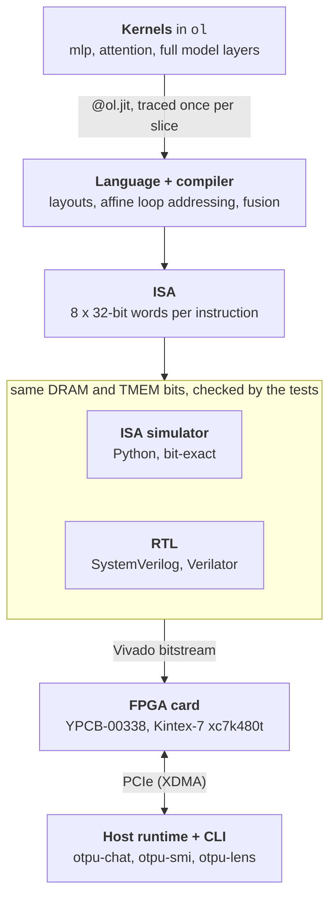

# openTPU

**A small LLM inference accelerator you can read end to end, and that runs on a real FPGA.**

openTPU is the whole stack of an accelerator in one repository: SystemVerilog RTL, an
instruction set with a bit-exact simulator, a small kernel language and compiler, and host
software for a Kintex-7 PCIe card. It is built to be learned from and changed: pick a layer,
change it, and measure what happens to the cycles.

Today it chats with Qwen3-0.6B, LFM2.5-230M and Qwen3.5-0.8B on an Inspur YPCB-00338 card
(Xilinx xc7k480t, two DDR3 channels), with real weights, and produces the same tokens as the
simulator, bit for bit.


*Left: `otpu-chat` running LFM2.5-230M on the card. Right: `otpu-smi` watching it: 84% busy and
8.15 GB/s from DRAM while the reply decodes, about 40 tok/s on the device. (The small model
reads the typo "ROme" as a company. The card runs the model faithfully, mistakes included.)*

## Where it stands

Measured on the card with the current production bitstream (2026-09-27): 100 MHz core clock,
DDR3-1066, PCIe Gen1 x8, int8 weights.

| Model | Decode, on the device | Decode, wall clock | Cycles per token |
|---|---|---|---|
| LFM2.5-230M | 40.7 tok/s | 38.5 tok/s | 2.46 M |
| Qwen3-0.6B | 14.6 tok/s | 14.1 tok/s | 6.85 M |
| Qwen3.5-0.8B | 10.3 tok/s | 9.9 tok/s | 9.75 M |

- **Correct:** all three models match the simulator token for token. The self-test passes, and
  so do all 127 hardware checks of `otpu-diag --mem full --soak 20`.
- **The build:** Vivado closes timing at 100 MHz with 55% of the LUTs and 15% of the DSPs,
  including the PCIe and DDR3 controllers.
- **Honest gaps:** decode moves about 8.4 to 9.5 GB/s of the DDR3's 17.1 GB/s peak, so about
  half the memory bandwidth is still on the table. The bitstream is loaded over JTAG, since the
  flash still holds an older image.

Work in progress, not yet in these numbers: 4-bit weights, a faster clock, and a more
efficient DRAM path (see [Open problems](#open-problems)).

## Try it

Everything except the card runs on a laptop.

```sh
pip install -e .                      # numpy, textual
pip install pytest torch transformers # for the tests and the models
python3 -m pytest -q                  # RTL tests also need Verilator 5 (they skip without it)
```

Chat with a model on the simulator. It gives the same tokens as the card, at a few seconds
per token instead of a few tens of milliseconds:

```sh
hf download LiquidAI/LFM2.5-230M --local-dir models/LFM2.5-230M
otpu-chat --model lfm2 --backend isa
```

With a card: build the bitstream (`make bit` in [`boards/ypcb-00338`](boards/ypcb-00338)), load
it over JTAG, then `sudo otpu-setup`, `otpu-selftest` and `otpu-chat --backend board`.
[docs/board.md](docs/board.md) walks through it, including what went wrong along the way.

| Command | What it does |
|---|---|
| `otpu-chat` | chat with Qwen3-0.6B, `--model lfm2` or `--model qwen35` |
| `otpu-smi` | temperature, estimated power, DRAM use and bandwidth, per-unit utilization and stalls |
| `otpu-lens` | record the card's hardware trace and open it in the profiler |
| `otpu-selftest` | registers, DRAM patterns, kernels, then a model |
| `otpu-diag` | every hardware check, as a works / does-not-work matrix |
| `otpu-setup` | installs the XDMA driver and rescans PCIe after a JTAG load |

The tools that run programs take a lock on the card, so a second one waits or tells you who
holds it. `otpu-smi` only reads counters and runs alongside them.

## How it works


```mermaid
%%{init: {"flowchart": {"wrappingWidth": 320}}}%%
flowchart TD
    K["<b>Kernels</b> in <code>ol</code><br/>mlp, attention, full model layers"]
    C["<b>Language + compiler</b><br/>layouts, affine loop addressing, fusion"]
    I["<b>ISA</b><br/>8 x 32-bit words per instruction"]
    subgraph X ["same DRAM and TMEM bits, checked by the tests"]
        direction LR
        S["<b>ISA simulator</b><br/>Python, bit-exact"]
        R["<b>RTL</b><br/>SystemVerilog, Verilator"]
    end
    B["<b>FPGA card</b><br/>YPCB-00338, Kintex-7 xc7k480t"]
    H["<b>Host runtime + CLI</b><br/>otpu-chat, otpu-smi, otpu-lens"]

    K -- "@ol.jit, traced once per slice" --> C
    C --> I
    I --> X
    X -- "Vivado bitstream" --> B
    B <-- "PCIe (XDMA)" --> H
```

Each layer is tested against the one below it. Kernels are checked against float64 numpy.
The simulator's fp32 arithmetic is checked against a Python model of the RTL's fp units. The
RTL must end every test with exactly the same DRAM and TMEM contents as the simulator: on
kernels, on whole model tokens, and on random programs built to make instructions fight over
the same memory.

The machine is deliberately simple:

```
            host: program images, DRAM images in, DRAM out
                                  |
 +--------------------------------v-------------------------------------+  x S slices
 | SEQ  1 instr/cycle, 16-slot scoreboard; 16 regs, LOOP, addr regs     |
 |   +--> DMA (LD/ST)      DRAM burst port                              |
 |   +--> MXU (MM)         1 streamed D-byte int8 row/cycle from DRAM   |
 |   |      x M <= 8 stationary rows from ACT RAM, block scales, fp32   |
 |   +--> QUANT (QACT/QST) TMEM fp32 -> ACT RAM int8 | DRAM int8 (KV)   |
 |   +--> VPU (VOP)        fp32: add mul max, exp2 recip rsqrt          |
 |   +--> COLL (GATHER/BAR) ---------------- shared by all slices ------+--> other slices
 |  TMEM: LANES banks, arbitrated per cycle                             |
 |  ACT RAM: int8 activations + scales; DRAM: private per slice         |
 +----------------------------------------------------------------------+
```

- **Every data movement is an instruction.** Nothing is hidden in a cache, so a trace can
  usually tell you why something is slow.
- **Concurrency without a scheduler.** The sequencer issues one instruction per cycle into a
  16-entry window and tracks what each one reads and writes. An instruction starts as soon as
  nothing older conflicts with it, so the units overlap on their own.
- **Numerics.** Weights, MXU activations and the KV cache are int8 with an fp32 scale per
  block; weights can also be 4-bit (FP4 or int4 elements with a two-level scale per block,
  about half the DRAM bytes per token: [docs/quant.md](docs/quant.md)). Everything else is
  fp32 with round-to-nearest-even and flush-to-zero. exp2, recip and rsqrt are fixed sequences
  of adds and multiplies, so Python, the simulator and the RTL agree bit for bit.
- **Decode is memory-bound.** A token streams every weight from DRAM once, so most of the
  performance work is about keeping DRAM busy.

## Writing a kernel

```python
from opentpu import language as ol

@ol.jit
def mlp(h, gamma, w_gate, w_up, w_down, out, eps):   # simplified; see kernels/mlp.py
    x = ol.load(h)
    xs = ol.quantize(rmsnorm(x, ol.load(gamma), eps))   # ACT RAM, reused by both matmuls
    g = ol.dot(xs, w_gate)                              # this slice's columns
    u = ol.dot(xs, w_up)
    a = ol.all_gather(silu(g) * u)
    y = ol.all_gather(ol.dot(a, w_down))
    if ol.program_id() == 0:
        ol.store(out, x + y)
```

```python
from opentpu import Config
from opentpu.runtime import Input, Output, Weight, launch

res = launch(mlp, Config(S=2), backend="rtl",            # or "isa"
             h=Input(h), gamma=Input(g), w_gate=Weight(Wg, 0), w_up=Weight(Wu, 0),
             w_down=Weight(Wd, 0), out=Output((M, H)), eps=1e-6)
```

## Seeing where the cycles go


*Lens replaying part of a Qwen3 decode step at 100 cycles per second. The dashes are data
moving. The colours show what each unit is doing in that cycle: busy, stalled on DRAM, lost
arbitration, or waiting on a dependency.*

Lens is the profiler. It records a run from the RTL, the simulator or the card's hardware
trace buffer, and opens it in the browser. You get the roofline, where the DRAM cycles went,
a zoomable timeline, this floorplan replay, and per-instruction and per-source-line tables.

```sh
python3 -m opentpu.lens record mlp attn -o run.otpuprof
python3 -m opentpu.lens open run.otpuprof
```

## Learning your way around

A suggested reading order:

1. **[docs/isa.md](docs/isa.md)**: the instruction set. It is short, and everything else is
   built on it.
2. **[`opentpu/kernels`](opentpu/kernels) and [docs/compiler.md](docs/compiler.md)**: how a
   kernel becomes instructions.
3. **[`opentpu/isasim.py`](opentpu/isasim.py)**: the reference semantics, in Python. When the
   RTL and the simulator disagree, this is the spec.
4. **[`rtl/`](rtl)**: the hardware, unit by unit, starting from
   [`rtl/top/otpu_top.sv`](rtl/top/otpu_top.sv).
5. **[docs/lfm2.md](docs/lfm2.md), [docs/qwen35.md](docs/qwen35.md),
   [docs/benchmarks.md](docs/benchmarks.md)**: whole models, where their cycles go, and their
   rooflines.
6. **[docs/board.md](docs/board.md) and [docs/host.md](docs/host.md)**: the physical card:
   clocks, DDR3 and PCIe bring-up, the driver and the tools.
7. **[docs/lens.md](docs/lens.md) and [docs/observability.md](docs/observability.md)**: the
   profiler and the hardware counters.
8. **[docs/tourney.md](docs/tourney.md)**: the automated architecture tournament. LLM agents
   propose RTL changes, and a change is kept only if it passes every bit-exact test and
   synthesizes smaller or faster. Before the first Vivado build, it took the accelerator
   logic's yosys estimate from 41 to 106 MHz.

## Open problems

Good places to dig in, roughly in order of how much they matter for speed:

- **DRAM efficiency.** Decode uses about half of the DDR3 bandwidth. The AXI adapter, request
  batching and the KV-cache write path are where the rest is lost.
- **4-bit weights.** A 4-bit MXU mode (4.25 bits per weight) is in progress. It roughly halves
  the bytes per token, for a small accuracy cost that is measured per model.
- **Clock speed.** The core runs at 100 MHz. The critical paths are known (TMEM arbitration,
  long routes across the die), and builds at 112 to 116 MHz are close to closing timing.
- **Qwen3.5's DeltaNet recurrence** runs on the vector unit and cannot keep up with DRAM.
- **Prefill** shares each weight pass across several prompt rows; the MXU could do more per
  pass.
- **Production polish:** writing the image to flash, reading the DDR3 ECC counters, and
  host overhead at long contexts.

## Contributing

Issues and pull requests are welcome, from typo fixes to new units. A few house rules keep
the project trustworthy:

- **Bit-exact or it didn't happen.** A change to the ISA, the simulator or the RTL must keep
  `python3 -m pytest -q` passing, including RTL against simulator.
- **Measure, then claim.** A performance number in a commit or a doc says how it was measured
  (on the card, in RTL simulation, or from a model) and is re-measured before it is quoted.
  Projections are labelled as projections.
- **Keep it readable.** Code and docs are meant to be learned from. A clear explanation of why
  something is the way it is counts as much as the change itself.

No card? Most of the work (compiler, simulator, RTL, profiler, models) needs only Python and
Verilator.

## Tests

| Suite | What it checks |
|---|---|
| `test_fp.py` | RTL fp units vs the Python fp32 model on 245K vectors |
| `test_isa.py`, `test_vops.py` | instruction semantics, loops, collectives, hazards; the recurrence ops (RDOT, OUTER, LOG2) |
| `test_compiler.py` | layouts, loop addressing, broadcasts, fusion safety |
| `test_kernels.py` | MLP and attention on the simulator vs float64 references |
| `test_rtl.py` | identical DRAM and TMEM on the RTL and the simulator: kernels and random programs |
| `test_perf.py` | lower bounds on kernel efficiency on the RTL |
| `test_board.py`, `test_host.py`, `test_observability.py`, `test_i2c.py` | the board model and the card's I2C through the host driver |
| `test_qwen3.py`, `test_lfm2.py`, `test_qwen35.py` | each model vs Hugging Face, and real tokens on the RTL |
| `test_lens.py`, `test_tourney.py` | the profiler and the tournament harness |

The real-model tests need the checkpoints in `models/` (`hf download Qwen/Qwen3-0.6B
--local-dir models/Qwen3-0.6B`, and the same for `LiquidAI/LFM2.5-230M` and
`Qwen/Qwen3.5-0.8B`).

## Accuracy

The models run in W8A8: the weights and the activations fed to the matrix unit are 8-bit
integers. Against Hugging Face's fp32 Qwen3-0.6B, greedy continuations stay identical for a
while, then drift apart where two candidate tokens are nearly tied. On eight short prompts, 2
of 8 match for all 16 tokens, and every first difference is Hugging Face's second or third
choice (`python3 tools/compare_hf.py --emulate`). A float64 model with the same 8-bit rounding
picks the device's tokens, so the differences come from quantization, not from bugs.

## License

Apache License 2.0. See [LICENSE](LICENSE).
