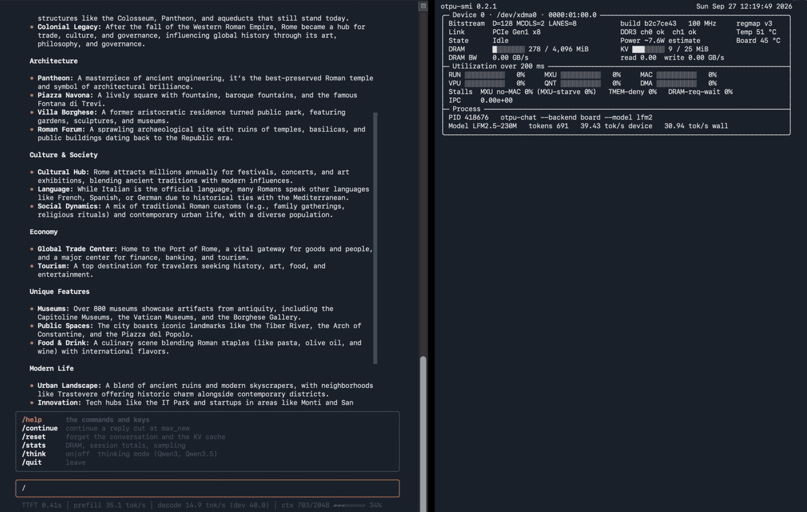
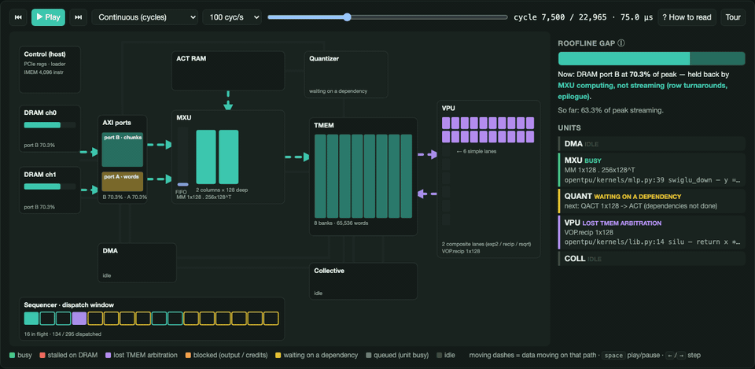

# openTPU

**An open-source AI accelerator, developed by AI.**

openTPU brings the lessons of [auto-arch-tournament](https://github.com/FeSens/auto-arch-tournament)
to AI accelerators. It asks two questions: how far can AI agents go at hardware design, and can
they build the chip that runs their own inference?



*`otpu-chat` running LFM2.5-230M on the FPGA card (left), with `otpu-smi` showing the card's
utilization and DRAM bandwidth (right).*

## A place to learn

openTPU is also a learning project. The whole accelerator lives in one small monorepo that you
can read end to end: the hardware design (SystemVerilog), the instruction set, a bit-exact
simulator, a kernel language and its compiler, and the host software that drives a real PCIe
card. If you want to understand how an AI accelerator works, from a matmul in Python down to
the wires, this is a good place to start.

## Results

The design runs nine modern models with their real weights on an Inspur YPCB-00338 card
(Xilinx Kintex-7 xc7k480t, two DDR3 channels), and the card produces the same tokens as the
simulator, bit for bit.

| Model | Weights | Decode, device | Decode, wall | Prefill, device | DRAM while decoding |
|:--|:--|--:|--:|--:|--:|
| LFM2.5-230M | int8 | 59.0 tok/s | 52.3 tok/s | 295.6 tok/s | 14.5 GB/s (85% of peak) |
| LFM2.5-230M | 4-bit, int8 head | 85.8 tok/s | 82.1 tok/s | 335.4 tok/s | 14.1 GB/s (82%) |
| Qwen3-0.6B | int8 | 21.6 tok/s | 21.3 tok/s | 92.1 tok/s | 14.4 GB/s (84%) |
| Qwen3-0.6B | 4-bit, int8 head | 31.3 tok/s | 30.7 tok/s | 103.4 tok/s | 13.9 GB/s (82%) |
| Qwen3.5-0.8B | int8 | 17.6 tok/s | 16.3 tok/s | 61.4 tok/s | 14.5 GB/s (85%) |
| Qwen3.5-0.8B | 4-bit, int8 head | 24.5 tok/s | 23.3 tok/s | 66.7 tok/s | 14.1 GB/s (83%) |
| Gemma 4 E2B | 4-bit, int8 head | 9.6 tok/s | 9.6 tok/s | 9.9 tok/s\* | 14.2 GB/s (83%) |
| Gemma 4 E2B | 4-bit, 4-bit head | 11.0 tok/s | 11.0 tok/s | 11.4 tok/s\* | 14.1 GB/s (82%) |
| LFM2-2.6B | int8 | 6.05 tok/s | 6.03 tok/s | 21.4 tok/s | 16.1 GB/s (94%) |
| LFM2-2.6B | 4-bit, int8 head | 10.96 tok/s | 10.93 tok/s | 20.6 tok/s | 15.8 GB/s (93%) |
| SmolLM3-3B | int8 | 5.00 tok/s | 4.99 tok/s | 21.1 tok/s | 16.0 GB/s (94%) |
| SmolLM3-3B | 4-bit, int8 head | 8.74 tok/s | 8.72 tok/s | 22.8 tok/s | 15.7 GB/s (92%) |
| Phi-4-mini (3.8B) | int8 | 3.99 tok/s | 3.98 tok/s | 13.8 tok/s | 16.0 GB/s (94%) |
| Phi-4-mini (3.8B) | 4-bit, int8 head | 6.56 tok/s | 6.55 tok/s | 15.0 tok/s | 15.8 GB/s (92%) |
| Qwen3.5-2B | int8 | 8.02 tok/s | 8.00 tok/s | 38.2 tok/s | 16.0 GB/s (94%) |
| Qwen3.5-2B | 4-bit, int8 head | 12.09 tok/s | 12.03 tok/s | 41.7 tok/s | 15.8 GB/s (92%) |
| Qwen3.5-4B | 4-bit, int8 head | 5.88 tok/s | 5.87 tok/s | 12.9 tok/s | 15.7 GB/s (92%) |

*Measured on the card: the first three models on 2026-09-29 with the production image
`deploy_champ_e698dcd7`. LFM2-2.6B, SmolLM3-3B and Phi-4-mini on 2026-09-30, and Qwen3.5-2B
and 4B on 2026-10-01, with build B, `deploy_fused133c_79c5707a`, production since then. Build B
decodes LFM2-2.6B, SmolLM3 and Phi-4-mini 8-9% faster than e698dcd7, at 92-94% of the DRAM peak
instead of 84-87%. Qwen3.5-4B's int8 image is over 4 GiB.*
- *The image: main e698dcd at 133.33 MHz, one bitstream for all models. It has LiteDRAM
  controllers calibrated by a small CPU inside the memory core, a four-column systolic matrix
  unit and the stream engine ([docs/stream.md](docs/stream.md)). DDR3-1066, with a 17.1 GB/s
  peak.*
- *The host: the card sits in opentpu (Intel Core i7-4790).*
- *Method, `tools/qual/perf.py`: decode is 64 greedy tokens after a 512-token prompt, with the
  host's argmax in the loop (not streamed). "Device" counts only the cycles the accelerator runs;
  "wall" adds the host. Prefill is the 512-token prompt, on the device.*
- *DRAM traffic comes from the card's own counters while it runs.*
- *Gemma 4 E2B was measured on 2026-09-30 with the same image, its per-layer embedding tables
  on the card (3.4-3.6 GiB images; [docs/gemma4.md](docs/gemma4.md)); in int8 it does not fit.
  It matches the simulator with the resident decode program, and Hugging Face's greedy tokens
  on three prompts, with either head. \*Its prompt ran one token per run (resident decode
  steps), not in prefill runs.*
- *Every configuration matches the simulator token for token, per-position and with the
  resident decode program. More detail in [docs/board.md](docs/board.md).*

With the logits streamed back while the card runs (`tools/decode_profile.py`, 96 tokens), 4-bit
decode is faster, in device / wall tok/s:
- LFM2: 89.5 / 84.5;
- Qwen3: 33.7 / 33.3;
- Qwen3.5: 24.6 / 24.2;
- LFM2-2.6B: 11.07 / 11.02 (build B);
- SmolLM3-3B: 8.92 / 8.89 (build B);
- Phi-4-mini: 6.69 / 6.67 (build B).

The previous production image, se-cand3, was built with the Xilinx MIG, a two-column matrix
unit and a 120.755 MHz clock. Measured the same way, the new image:
- **decode:** within 2.3% of se-cand3's in every configuration. Decode is bound by DRAM, and
  LiteDRAM reads at 82-85% of the DDR3 peak, as the MIG did.
- **prefill:** 1.3x (Qwen3.5) to 2.0x (LFM2 4-bit) faster.
- **calibration:** when the image starts, the core's CPU calibrates both DDR3 channels in 12 s,
  with no host involvement.

The earlier images and their numbers are in [docs/board.md](docs/board.md), section 5.

Mixture-of-experts models bigger than the card's 4 GiB run with their experts streamed from host
storage ([docs/offload.md](docs/offload.md), section 10). The card routes each token and computes
every expert, and it keeps the experts in per-layer slots in its DRAM. The host only copies
missing experts from a pool file into those slots, at the link's rate (section 10.1). Measured
on 2026-10-01 with build B (79c5707a), the card's own decode loop picking every token, 4-bit
experts, int8 head:
- **LFM2.5-8B-A1B** (8.5B parameters, 1.7B active): 10.6 tok/s over 160 tokens. 98.5% of expert
  uses hit the slots, and 5.2 MB streamed per token.
- **Qwen3.5-35B-A3B** (34.7B parameters, 3.0B active): 3.95 tok/s, with Hugging Face's 16
  greedy tokens. 62% of expert uses hit, and 153 MB streamed per token at 1.41 GB/s over PCIe
  (section 10.3).
- Both match the simulator bit for bit.

4-bit weights ([docs/quant.md](docs/quant.md)) use FP4 values with two-level block scales, 4.25
bits per weight, and keep the LM head in int8 for accuracy. They cut the bytes per token by about
a third and raise decode speed by 40% (Qwen3.5) to 45% (Qwen3, LFM2), at a measurable cost in
perplexity that docs/quant.md reports per model.

The host is nearly out of the way. For LFM2 and Qwen3 the card runs one decode program compiled
once, which reads the position from a register and looks up its own embedding and RoPE rows, and
the logits stream back while the card is still running: the host adds 0.17 to 0.30 ms per
token on omarchy (0.45 to 1.3 ms on opentpu).
Qwen3.5 runs the same way for decode; its prefill still compiles each chunk's program on the host,
ahead of the card.

## How it works

```
  Kernels in ol              mlp, attention, full model layers
        |  @ol.jit
  Language + compiler        layouts, affine loop addressing, fusion
        |
  ISA                        8 x 32-bit words per instruction
        |
  ISA simulator  <======>  RTL          same bits, checked by the tests
  (Python)                 (SystemVerilog)
                            |  Vivado bitstream
                           FPGA card    Kintex-7 xc7k480t
                            |  PCIe
                           Host         otpu-chat, otpu-smi, otpu-lens
```

The machine is deliberately simple. A sequencer issues one instruction per cycle to a few
units: DMA moves data, the matrix unit multiplies int8 weights streamed from DRAM, the vector
unit does fp32 math, and a quantizer turns results back into int8. There is no cache and no
hidden scheduling: every data movement is an instruction, so a trace shows exactly where the
cycles go. [docs/isa.md](docs/isa.md) describes the whole instruction set.

A kernel looks like this:

```python
from opentpu import language as ol

@ol.jit
def mlp(h, gamma, w_gate, w_up, w_down, out, eps):   # simplified; see kernels/mlp.py
    x = ol.load(h)
    xs = ol.quantize(rmsnorm(x, ol.load(gamma), eps))
    g = ol.dot(xs, w_gate)
    u = ol.dot(xs, w_up)
    a = ol.all_gather(silu(g) * u)
    y = ol.all_gather(ol.dot(a, w_down))
    if ol.program_id() == 0:
        ol.store(out, x + y)
```

Because every data movement is an instruction, a trace of a run explains its speed. Lens, the
profiler, records a run from the RTL, the simulator or the card and opens it in the browser,
with a roofline, a timeline and per-instruction tables ([docs/lens.md](docs/lens.md)).



*Lens replaying part of a Qwen3 decode step. Colours show what each unit is doing in each
cycle: busy, waiting on DRAM, or waiting on another instruction.*

## Try it

Everything except the card runs on a laptop.

```sh
pip install -e .
pip install pytest torch transformers
python3 -m pytest -q          # RTL tests also need Verilator 5

hf download LiquidAI/LFM2.5-230M --local-dir models/LFM2.5-230M
otpu-chat --model lfm2 --backend isa    # chat on the simulator
```

With a card, build the bitstream (`make bit` in [`boards/ypcb-00338`](boards/ypcb-00338)), load
it over JTAG, then run `sudo otpu-setup` and `otpu-chat --backend board`.
[docs/board.md](docs/board.md) walks through the bring-up.

| Command | What it does |
|:--|:--|
| `otpu-chat` | chat with Qwen3-0.6B, LFM2.5-230M (`--model lfm2`), Qwen3.5-0.8B (`--model qwen35`), LFM2-2.6B (`lfm2-2.6b`), SmolLM3-3B (`smollm3`), Phi-4-mini (`phi4-mini`) or Qwen3.5-2B / 4B (`qwen35-2b`, `qwen35-4b`) |
| `otpu-smi` | temperature, power, DRAM bandwidth and per-unit utilization |
| `otpu-lens` | record a run and open it in the profiler |
| `otpu-selftest`, `otpu-diag` | check that the card works |

## Where to start reading

1. [docs/isa.md](docs/isa.md): the instruction set. Everything else is built on it.
2. [`opentpu/kernels`](opentpu/kernels) and [docs/compiler.md](docs/compiler.md): how a kernel
   becomes instructions.
3. [`opentpu/isasim.py`](opentpu/isasim.py): the simulator, which is the spec.
4. [`rtl/`](rtl): the hardware, starting from [`rtl/top/otpu_top.sv`](rtl/top/otpu_top.sv).
5. [docs/lfm2.md](docs/lfm2.md), [docs/qwen35.md](docs/qwen35.md), [docs/llama.md](docs/llama.md),
   [docs/benchmarks.md](docs/benchmarks.md): whole models and where their cycles go.
6. [docs/board.md](docs/board.md): the physical card, from clocks to PCIe.

## What's next

- **The last few percent of DRAM.** Decode is bound by DRAM efficiency: it reads 82 to 85% of the
  DDR3-1066 peak. Work on the LiteDRAM path's efficiency is under way.
- **Timing margin and area.** The design closes 133.33 MHz, the clock at which the 128-byte port
  matches the two DDR3 channels, but only just (WNS +0.032 ns). A tournament of Vivado runs keeps
  working on its margin and area. Decode is bound by DRAM, so a faster clock mostly helps prefill.
- **Faster prefill.** The four-column systolic matrix unit is in the production image; prefill is
  still limited by the matrix unit's multiply rate.

## Contributing

Issues and pull requests are welcome, and most of the work needs only Python and Verilator, not
an FPGA. Changes to the ISA, the simulator or the RTL must keep `python3 -m pytest -q` passing,
and performance claims should say how they were measured.

## License

Apache License 2.0. See [LICENSE](LICENSE).
