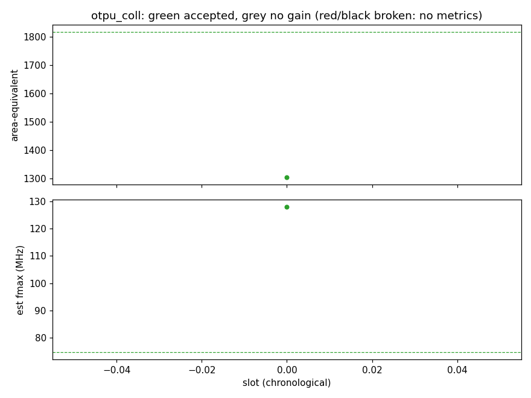

# Tourney report: otpu_coll

Champion 9a8e6b170: LUT 1325, LUTRAM 0, FF 262, DSP 9, BRAM36 0, logic 8.055 ns, est fmax 74.7 MHz, area-eq 1816, perf proxy 1912335 cycles (yosys).

## Slots

| slot | outcome | title | area_eq | fmax | impl model @effort | cost $ | min | reason |
|---|---|---|---|---|---|---|---|---|
| r20260923-195339-s0 | accepted | Strength-reduce GATHER addressing: running address | 1305 | 128 | claude-opus-5-5 @high | 1.12 | 5 | area -28.1% at 128 MHz (>= 110) |

## Per implementation model

| impl model @effort | slots | accepted | no gain | broken/error | accept rate | cost $ | $ / slot | $ / accept | agent min (hyp/impl/scribe) |
|---|---|---|---|---|---|---|---|---|---|
| claude-opus-5-5 @high | 1 | 1 | 0 | 0 | 100% | 1.12 | 1.12 | 1.12 | 2/2/0.1 |

